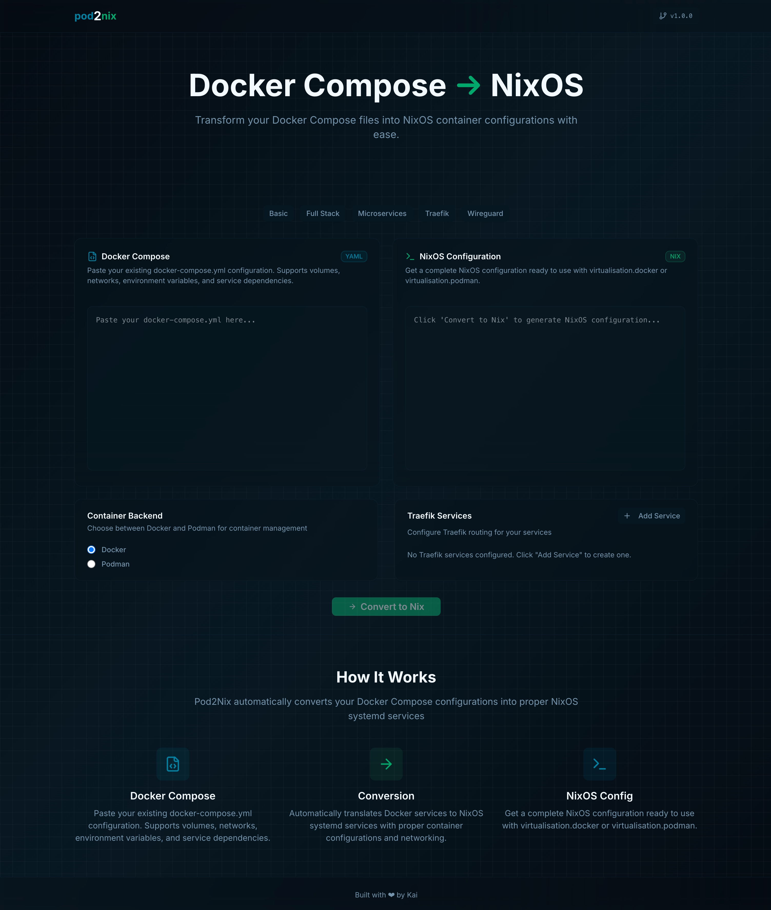

# pod2nix — Docker Compose → NixOS Converter

[](https://github.com/kaiiiiiiiii/pod2nix)
[](LICENSE)
[](https://nixos.org)

A modern, user-friendly web application that converts Docker Compose
configurations into NixOS container configurations using
`virtualisation.oci-containers`. The app is built with React 19, Vite 7,
Tailwind CSS v4, and TanStack Router/Start.

_Try it out live:_
[https://kaiiiiiiiii.github.io/pod2nix/](https://kaiiiiiiiii.github.io/pod2nix/)



## Highlights

- Docker/Podman backend targeting with accurate NixOS generation
- Traefik integration via UI and label auto-detection
- Systemd customization via `pod2nix.systemd.*` labels
- Responsive, mobile-friendly UI (dialog → drawer)
- Real-time conversion with clear errors

## Feature Matrix

| Capability                                                     | Status | Notes                                                                |
| -------------------------------------------------------------- | ------ | -------------------------------------------------------------------- |
| Services (image, env, ports, volumes, depends_on)              | ✅     | Environment map/array, ports, named volumes vs bind mounts           |
| Networks (compose + references)                                | ✅     | Generates network services when defined                              |
| Volumes (compose + service refs)                               | ✅     | Generates volume services for lifecycle management                   |
| Restart policies                                               | ✅     | Mapped to systemd via overrides                                      |
| Systemd overrides (labels)                                     | ✅     | `pod2nix.systemd.service.*`, `pod2nix.systemd.unit.*`                |
| Traefik (labels → dynamic config)                              | ✅     | Routers/services built from labels; `traefik.docker.network` handled |
| Healthchecks, limits, caps, devices, sysctls, extra_hosts, dns | ✅     | Projected to `extraOptions`                                          |
| Backends                                                       | ✅     | Docker or Podman selectable for generation                           |

Implementation entry points:

- Converter: [convertComposeToNix()](src/lib/converter.ts:92)
- Traefik label parsing: [parseTraefikLabels()](src/lib/converter.ts:748)
- Nix config emission: [generateNixConfig()](src/lib/converter.ts:583)

## Quick Start

### Prerequisites

- Node.js 18+ and a modern web browser

### Install and run (pnpm)

```bash
git clone https://github.com/kaiiiiiiiii/pod2nix.git
cd pod2nix
pnpm install
pnpm run dev
```

- Dev server: http://localhost:3000/pod2nix (site base path is `/pod2nix`)

Alternative package managers:

- npm: `npm install && npm run dev`
- yarn: `yarn && yarn dev`

### Build and preview

```bash
pnpm run build     # runs scripts/update-config.js before building
pnpm run serve     # Vite preview
```

## Usage

1. Paste your Docker Compose YAML into the left editor.
2. Configure options (e.g., target backend: Docker/Podman).
3. Optionally add Traefik routes via the "Add Service" dialog.
4. Convert to Nix and copy the generated config.

Traefik service dialog:

- UI component:
  [traefik-service-dialog.tsx](src/components/traefik-service-dialog.tsx)
- Handler: [TraefikServiceDialog()](src/components/traefik-service-dialog.tsx:1)
- Responsive behavior (dialog ↔ drawer):
  [responsive-dialog.tsx](src/components/responsive-dialog.tsx)

## Traefik Integration

Two ways to define routes:

- UI-based. Add entries like:
  - Name: `webapp`
  - URL: `http://localhost:3000`
  - Host: `example.com`
  - Entrypoint: `web`
  - TLS + Cert Resolver (optional)

- Compose label-based. Example:

```yaml
services:
  app:
    image: myorg/app:latest
    labels:
      traefik.enable: "true"
      traefik.http.routers.app.rule: "Host(`example.com`)"
      traefik.http.routers.app.entrypoints: "web"
      traefik.http.routers.app.tls.certresolver: "letsencrypt"
      traefik.http.services.app.loadbalancer.server.port: "3000"
      traefik.docker.network: "web"
```

What the converter does:

- Detects Traefik labels and derives routers/services.
- Ensures `traefik.docker.network` is present in the service networks.
- Emits Nix under `services.traefik.dynamicConfigOptions.http` via
  [generateTraefikConfig()](src/lib/converter.ts:666).

## Advanced Compose → Nix Mapping

- Containers: [generateContainerConfig()](src/lib/converter.ts:188)
  - Env: supports map and array env forms
  - Volumes: named volumes normalized as `project_volume:volume:rw`
  - Cmd/workdir/user/ports/labels/dependsOn/logging
  - Non-Traefik labels passed through to container labels

- Systemd overrides: [generateSystemdServiceConfig()](src/lib/converter.ts:317)
  - Restart policy mapping: [mapRestartPolicy()](src/lib/converter.ts:725)
  - `pod2nix.systemd.service.*` → `serviceConfig`
  - `pod2nix.systemd.unit.*` → `unitConfig`

- Extra runtime options: [generateExtraOptions()](src/lib/converter.ts:391)
  - privileged, cap_add/cap_drop, devices, dns, sysctls, extra_hosts
  - deploy.resources.limits (cpus/memory)
  - healthcheck.test

- Volume/Network lifecycle:
  [generateVolumeServices()](src/lib/converter.ts:513),
  [generateNetworkServices()](src/lib/converter.ts:546)

- Final Nix assembly: [generateNixConfig()](src/lib/converter.ts:583)
  - Sets `virtualisation.<backend>` and `virtualisation.oci-containers.backend`
  - Appends container blocks, systemd customizations, volume/network helpers,
    Traefik

## Project Structure

- App configuration: [src/lib/config.ts](src/lib/config.ts) (auto-generated;
  includes [APP_CONFIG](src/lib/config.ts:3))
- Converter engine: [src/lib/converter.ts](src/lib/converter.ts)
- Built-in templates: [src/lib/docker-templates.ts](src/lib/docker-templates.ts)
- Router setup: [src/router.tsx](src/router.tsx) with
  [createRouter()](src/router.tsx:4)
- Route tree: [src/routeTree.gen.ts](src/routeTree.gen.ts) (generated)
- Routes: [src/routes/\_\_root.tsx](src/routes/__root.tsx),
  [src/routes/index.tsx](src/routes/index.tsx)
- UI components: [src/components/ui/button.tsx](src/components/ui/button.tsx),
  [src/components/ui/card.tsx](src/components/ui/card.tsx),
  [src/components/ui/dialog.tsx](src/components/ui/dialog.tsx),
  [src/components/ui/input.tsx](src/components/ui/input.tsx),
  [src/components/ui/label.tsx](src/components/ui/label.tsx),
  [src/components/ui/badge.tsx](src/components/ui/badge.tsx)
- Responsive dialog/drawer:
  [src/components/responsive-dialog.tsx](src/components/responsive-dialog.tsx)
- Traefik service UI:
  [src/components/traefik-service-dialog.tsx](src/components/traefik-service-dialog.tsx)
- Hooks: [src/hooks/use-mobile.ts](src/hooks/use-mobile.ts)
- App shell: [src/App.tsx](src/App.tsx)
- Styles: [src/styles.css](src/styles.css)
- Public assets: [public/manifest.json](public/manifest.json),
  [public/logo192.png](public/logo192.png),
  [public/logo512.png](public/logo512.png),
  [public/robots.txt](public/robots.txt)

## Tech Stack

- React 19 + TypeScript 5.7
- Vite 7 with React plugin
- Tailwind CSS v4 + @tailwindcss/vite
- TanStack Router/Start
- Radix UI primitives + Vaul Drawer
- YAML parsing via `yaml`
- Validation via `zod`

Primary dependencies and scripts: see [package.json](package.json)

## Development

### Scripts

| Script       | Command                 | Description                                         |
| ------------ | ----------------------- | --------------------------------------------------- |
| dev          | `pnpm run dev`          | Start Vite dev server on port 3000                  |
| build        | `pnpm run build`        | Update config + TypeScript compilation + Vite build |
| serve        | `pnpm run serve`        | Preview production build (Vite preview)             |
| test         | `pnpm run test`         | Run unit tests with Vitest                          |
| lint         | `pnpm run lint`         | Run ESLint                                          |
| format       | `pnpm run format`       | Prettier                                            |
| check        | `pnpm run check`        | Format + lint (write/fix)                           |
| check-unused | `pnpm run check-unused` | Check for unused dependencies                       |

Notes:

- The build script runs `scripts/update-config.js` to sync version and homepage
  from package.json to [src/lib/config.ts](src/lib/config.ts).
- The legacy converter export
  [convertDockerComposeToNix()](src/lib/converter.ts:689) remains for backward
  compatibility, delegating to [convertComposeToNix()](src/lib/converter.ts:92).

### Coding Guidelines

- TypeScript-first; prefer explicit types
- Accessible components (Radix primitives, keyboard support)
- Mobile-friendly (responsive dialog/drawer via
  [responsive-dialog.tsx](src/components/responsive-dialog.tsx))
- Keep logic in the converter module, UI components stateless where practical

## Example Snippets

Compose labels for systemd:

```yaml
services:
  web:
    image: nginx:alpine
    labels:
      pod2nix.systemd.service.Restart: "always"
      pod2nix.systemd.unit.After: "network.target"
```

Named volume lifecycle (auto-generated systemd oneshot units):

```yaml
volumes:
  postgres_data: {}
```

## Deployment

This project builds to a static bundle suitable for static hosting.

- Build: `pnpm run build`
- Preview: `pnpm run serve`
- Deploy: Upload the `dist/` directory to your static host or serve via
  Nginx/Netlify/etc.

## Known Limitations

- Only Traefik HTTP routers/services are generated from labels today
- Some Compose fields not listed above may be ignored
- `start` script in [package.json](package.json) is reserved for SSR targets and
  not used by the current SPA build

## Contributing

1. Fork the repository and create a feature branch
2. Follow existing patterns and component conventions
3. Add types and tests where relevant
4. Run: `pnpm run check` and ensure build passes
5. Open a PR with a clear description

## License

This project is licensed under the MIT License. See [LICENSE](LICENSE) for
details.

## Acknowledgments

- [pod2nix (methodology)](https://github.com/aksiksi/pod2nix)
- Tailwind CSS, Radix UI, Lucide, TanStack Router
- The Nix community

---

Built with ❤️ for the Nix ecosystem.
